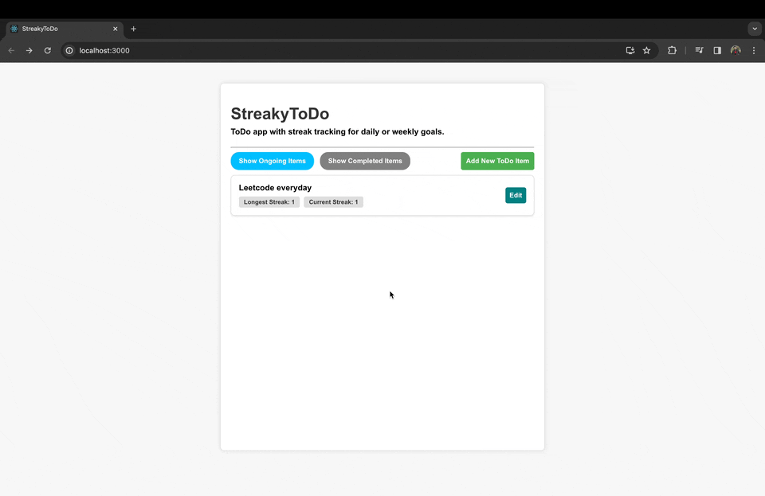

# Streaky ToDo

Streaky ToDo is a React app designed to help you manage your daily or weekly goals while tracking your streaks.

## Features

- Create ToDo items with daily or weekly goals.
- Specify weekdays for daily goals or a count for weekly goals.
- Track completion for each day.
- Calculate current and longest streaks based on weekly count or tracking days.
- Mark ToDo items as ongoing or completed.

#### Note

- A streak is not considered over until the day is finished (for daily goals) or until the week is over (for weekly
  goals).
- Users can backtrack to update any day, and the streak will adjust accordingly.

## Demo



## Setup Guide

Follow these steps to set up the Streaky ToDo app on your local machine:

1. **Clone the repository:**

   ```bash
   git clone https://github.com/sharmadhiraj/streaky-todo.git
   ```

2. **Navigate to the project directory:**

   ```bash
   cd streaky-todo
   ```

3. **Install dependencies:**

   ```bash
   npm install
   ```

4. **Run the app:**

   ```bash
   npm start
   ```

   The app will be accessible at [http://localhost:3000](http://localhost:3000).

## Possible Improvements

- UI enhancements
- Storage mechanism upgrade (currently uses local storage)
- Test implementation
- Feature to set the start date as the current date (currently, the created date is considered as the start date)

I am actively working on improvements, and any feedback is highly welcomed.